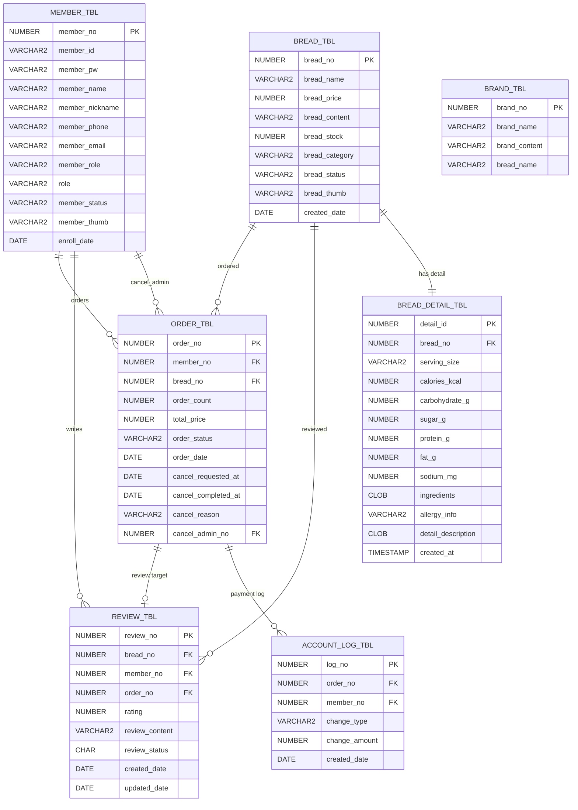
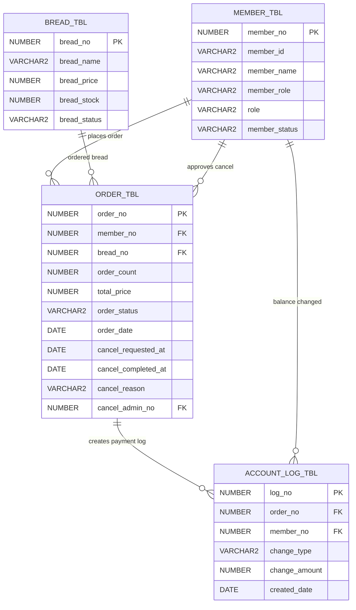

# B2B 베이커리 납품 주문 플랫폼
소규모 카페와 동네 매장을 대상으로 베이커리 상품을 조회하고 대량 주문 및 주문 취소 관리를 할 수 있는 데스크탑 기반 B2B 주문 관리 웹 서비스입니다.
프론트엔드에서는 예상 주문 금액을 계산하여 사용자에게 보여주고, 실제 주문 금액은 백엔드에서 상품 번호를 기준으로 DB 가격을 다시 조회하여 계산하도록 구현했습니다.

현재 시간 관계상 브랜드의 일부 기능과 메뉴, 이벤트 , 상점등의 기능은  
        구현이 미완료된 상태입니다. 

1. 메인화면

2. 빵 상세 페이지

3. 주문창

4. 관리자 페이지

5. 마이페이지
--> 주문 취소를 하면 취소요청을 마이페이지에서 확인이 가능하고, 관리자가 승인하면 취소요청 -> 취소 완료로 바뀜 

전체 ERD

결제/ 주문 중심 ERD

